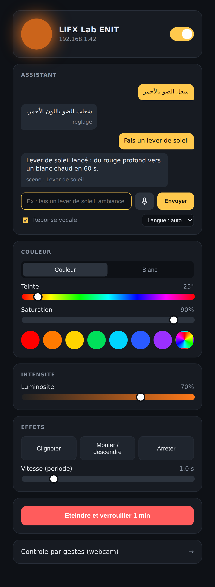
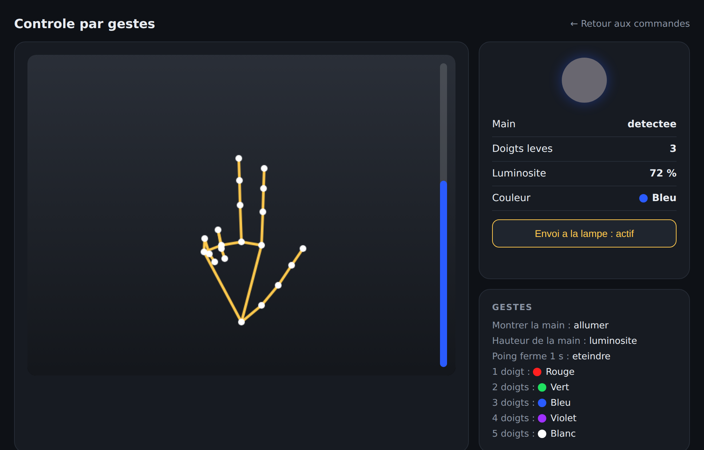
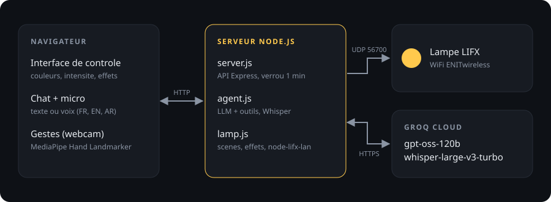

<div align="center">

# 💡 Lampe ENIT

**Controle d'une ampoule LIFX en reseau local, par interface web, assistant IA, voix et gestes.**

Projet de labo realise a l'ENIT (Ecole Nationale d'Ingenieurs de Tunis).


</div>

---

## ✨ Fonctionnalites

<table>
<tr>
<td width="340" valign="top">

</td>
<td valign="top">

### 🎛️ Controle manuel
Couleur RGB complete (teinte, saturation, selecteur libre), blanc chaud ou froid (1500 a 9000 K), luminosite, allumer et eteindre.

### 🌈 Effets
Clignoter et monter / descendre en intensite, avec vitesse reglable. Les effets tournent directement dans l'ampoule (waveforms LIFX), donc ils restent fluides meme si le WiFi est lent.

### 🤖 Assistant IA
On decrit une ambiance en langage naturel : *"fais un lever de soleil"*, *"ambiance nuit d'ete"*, *"mode urgence"*. Le LLM compose lui meme les couleurs, les transitions et les sequences grace a l'appel d'outils. Aucun scenario code en dur.

### 🎙️ Commande vocale
Micro dans le navigateur, transcription par Whisper, puis execution par le LLM. Francais, anglais, arabe et dialecte tunisien (*"شعل الضو"*). Reponse lue a voix haute.

### 🔒 Verrou 1 minute
Eteint la lampe pendant 60 s et renvoie la commande en continu pour reprendre la main si quelqu'un d'autre la rallume.

</td>
</tr>
</table>

### ✋ Controle par gestes



| Geste | Action |
|---|---|
| Montrer la main | Allumer |
| Hauteur de la main | Luminosite (1 a 100 %) |
| 1 / 2 / 3 / 4 / 5 doigts | Rouge / Vert / Bleu / Violet / Blanc |
| Poing ferme 1 s | Eteindre |

---

## 🏗️ Architecture



| Fichier | Role |
|---|---|
| `discover.js` | Decouvre la lampe sur le reseau et sauvegarde son IP et sa MAC dans `config.json` |
| `server.js` | Serveur Express : API REST, verrou, routes chat et transcription |
| `lamp.js` | Acces a la lampe (node-lifx-lan) et lecteur de scenes annulables |
| `agent.js` | Agent LLM Groq avec 5 outils, et transcription Whisper |
| `public/index.html` | Interface principale (commandes, chat, micro) |
| `public/gestures.html` | Controle par webcam avec MediaPipe |

### Outils donnes au LLM

| Outil | Usage |
|---|---|
| `set_light` | Etat fixe avec transition douce |
| `play_scene` | Sequence d'etapes (couleur, fondu, maintien), en boucle possible |
| `waveform` | Effet continu joue par l'ampoule (pulse, sine, triangle, saw) |
| `stop_effects` | Arrete la scene ou l'effet en cours |
| `get_state` | Lit l'etat actuel de la lampe |

---

## 🚀 Installation

**Prerequis :** Node.js 18 ou plus, le PC et la lampe sur le meme reseau WiFi.

```bash
git clone <url-du-repo>
cd lampe_enit
npm install
```

**1. Trouver la lampe**

```bash
npm run discover            # sauvegarde l'IP dans config.json
node discover.js "nom"      # si plusieurs lampes, choisir par label
```

**2. Ajouter la cle Groq** (gratuite sur [console.groq.com](https://console.groq.com/keys))

```bash
cp .env.example .env        # puis coller la cle dans GROQ_API_KEY
```

**3. Lancer**

```bash
npm start
```

| Page | Adresse |
|---|---|
| Interface principale | http://localhost:3000 |
| Controle par gestes | http://localhost:3000/gestures.html |

---

## ⚙️ Configuration

| Variable | Defaut | Description |
|---|---|---|
| `GROQ_API_KEY` | | Cle API Groq (obligatoire pour l'assistant et la voix) |
| `GROQ_MODEL` | `openai/gpt-oss-120b` | Modele de chat (ex : `llama-3.3-70b-versatile`) |
| `GROQ_STT_MODEL` | `whisper-large-v3-turbo` | Modele de transcription |

---

## 🛠️ Depannage

| Probleme | Solution |
|---|---|
| Aucune lampe trouvee | Autoriser Node.js dans le pare-feu Windows (reseaux prive et public, UDP 56700) |
| Personne ne trouve la lampe | Le WiFi isole peut etre les appareils entre eux (client isolation) |
| La lampe change toute seule | D'autres personnes la controlent en meme temps : la derniere commande gagne |
| Assistant ou micro en erreur | Verifier `GROQ_API_KEY` dans `.env` puis relancer `npm start` |
| Webcam ou micro refuses | Ouvrir la page via `localhost` et autoriser l'acces dans le navigateur |

---

<div align="center">

Realise par **Aziz** · ENIT

</div>
